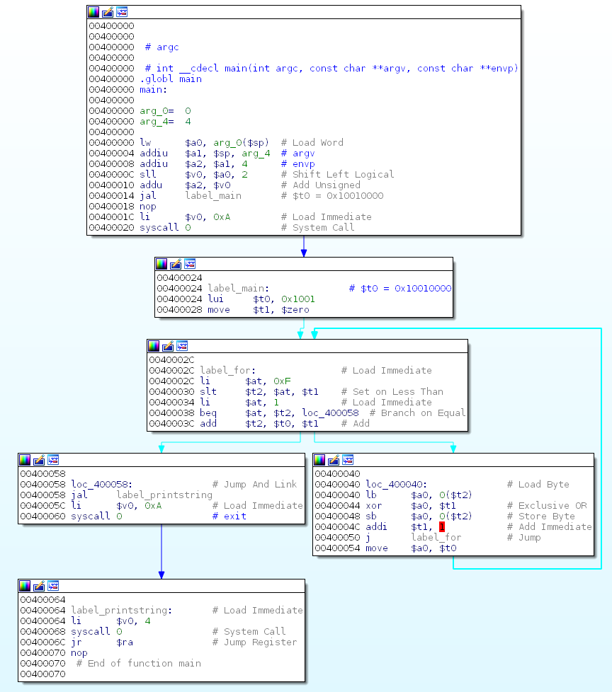

# Internetwache CTF 2016
## Rev50 - SPIM

### Task description:
*My friend keeps telling me, that real hackers speak assembly fluently. Are you a real hacker? Decode this string: "IVyN5U3X)ZUMYCs"*

### Solution:
We're given some assembly code along the task description. A quick search for "SPIM" reveals that it's a MIPS32 simulator.
It doesn't take a genius to figure out this code is MIPS assembly ;).

```asm
User Text Segment [00400000]..[00440000]
[00400000] 8fa40000  lw $4, 0($29)            ; 183: lw $a0 0($sp) # argc 
[00400004] 27a50004  addiu $5, $29, 4         ; 184: addiu $a1 $sp 4 # argv 
[00400008] 24a60004  addiu $6, $5, 4          ; 185: addiu $a2 $a1 4 # envp 
[0040000c] 00041080  sll $2, $4, 2            ; 186: sll $v0 $a0 2 
[00400010] 00c23021  addu $6, $6, $2          ; 187: addu $a2 $a2 $v0 
[00400014] 0c100009  jal 0x00400024 [main]    ; 188: jal main 
[00400018] 00000000  nop                      ; 189: nop 
[0040001c] 3402000a  ori $2, $0, 10           ; 191: li $v0 10 
[00400020] 0000000c  syscall                  ; 192: syscall # syscall 10 (exit) 
[00400024] 3c081001  lui $8, 4097 [flag]      ; 7: la $t0, flag 
[00400028] 00004821  addu $9, $0, $0          ; 8: move $t1, $0 
[0040002c] 3401000f  ori $1, $0, 15           ; 11: sgt $t2, $t1, 15 
[00400030] 0029502a  slt $10, $1, $9          
[00400034] 34010001  ori $1, $0, 1            ; 12: beq $t2, 1, exit 
[00400038] 102a0007  beq $1, $10, 28 [exit-0x00400038] 
[0040003c] 01095020  add $10, $8, $9          ; 14: add $t2, $t0, $t1 
[00400040] 81440000  lb $4, 0($10)            ; 15: lb $a0, ($t2) 
[00400044] 00892026  xor $4, $4, $9           ; 16: xor $a0, $a0, $t1 
[00400048] a1440000  sb $4, 0($10)            ; 17: sb $a0, 0($t2) 
[0040004c] 21290001  addi $9, $9, 1           ; 19: add $t1, $t1, 1 
[00400050] 0810000b  j 0x0040002c [for]       ; 20: j for 
[00400054] 00082021  addu $4, $0, $8          ; 24: move $a0, $t0 
[00400058] 0c100019  jal 0x00400064 [printstring]; 25: jal printstring 
[0040005c] 3402000a  ori $2, $0, 10           ; 26: li $v0, 10 
[00400060] 0000000c  syscall                  ; 27: syscall 
[00400064] 34020004  ori $2, $0, 4            ; 30: li $v0, 4 
[00400068] 0000000c  syscall                  ; 31: syscall 
[0040006c] 03e00008  jr $31                   ; 32: jr $ra 
```

So first, because I don't like looking at a page of text, let's make this prettier!
I extracted the hex encoded machine code:

```
8fa4000027a5000424a600040004108000c230210c10000900000000
3402000a0000000c3c081001000048213401000f0029502a34010001
102a0007010950208144000000892026a1440000212900010810000b
000820210c1000193402000a0000000c340200040000000c03e00008
```
and pasted it into a working mips executable. Something from uClibc did the job. After rebasing the executable to start at `0x400000` and fiddling with the comments a bit, I got this:



Much better! :)

At `label_for` we have a loop that loops from `0` to `15` and at `0x400040` we xor the `i-th` letter with `i`.

A quick one-liner in python got us the flag:
```python
In [4]: "".join(chr(ord("IVyN5U3X)ZUMYCs"[i]) ^ i) for i in range(15))
Out[4]: 'IW{M1P5_!S_FUN}'
```

### Flag:
`IW{M1P5_!S_FUN}`
